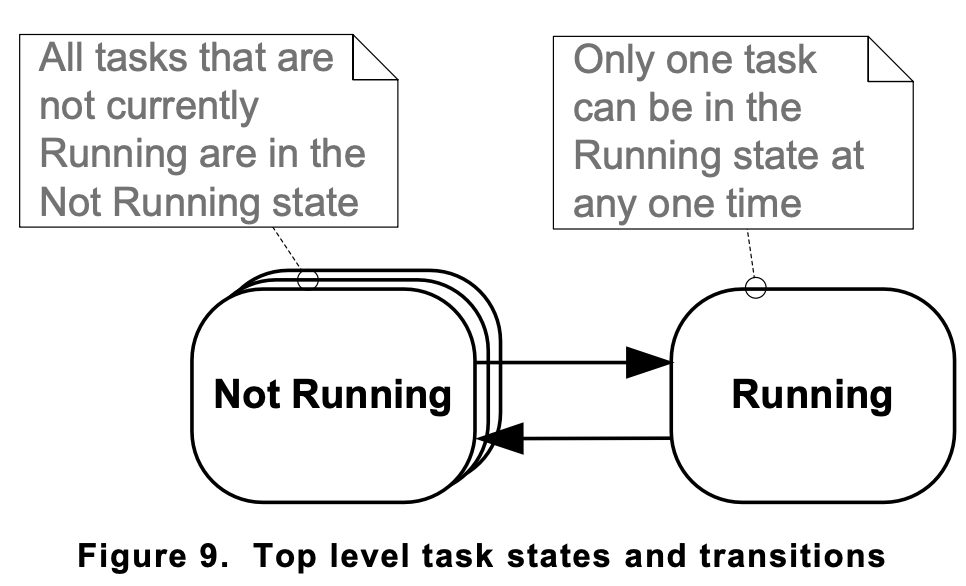

## Top Level Task States

- Only one task can run on one core.
- The tasks can exist in one of the two states Running or Not running. Not running contains a number of sub-states.

- **switched in** or **swapped in**: A task transitioned from the Not Running state to the Running state
- **switched out** or **swapped out**: A task transitioned from the Running state to the Not Running state
- The FreeRTOS scheduler is the only entity that can switch a task in and out