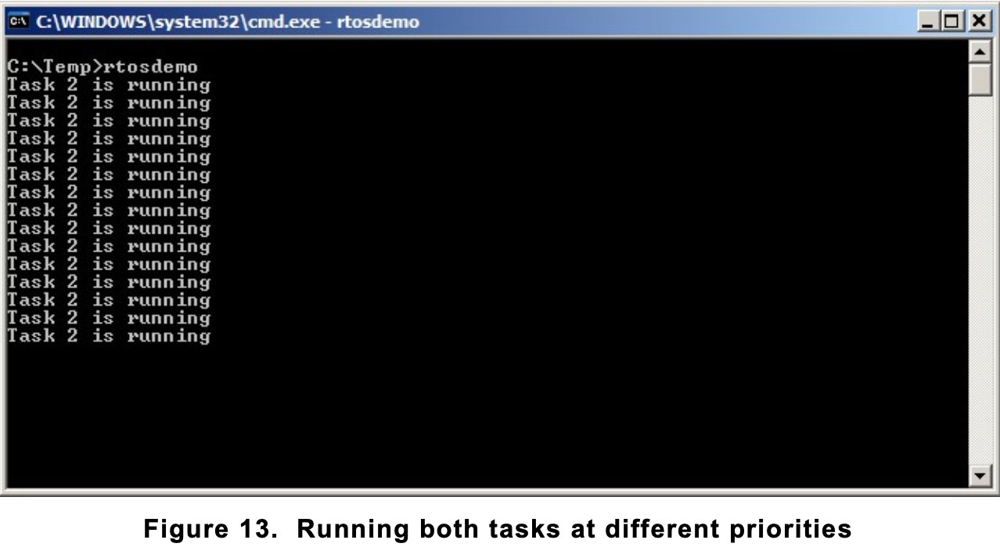
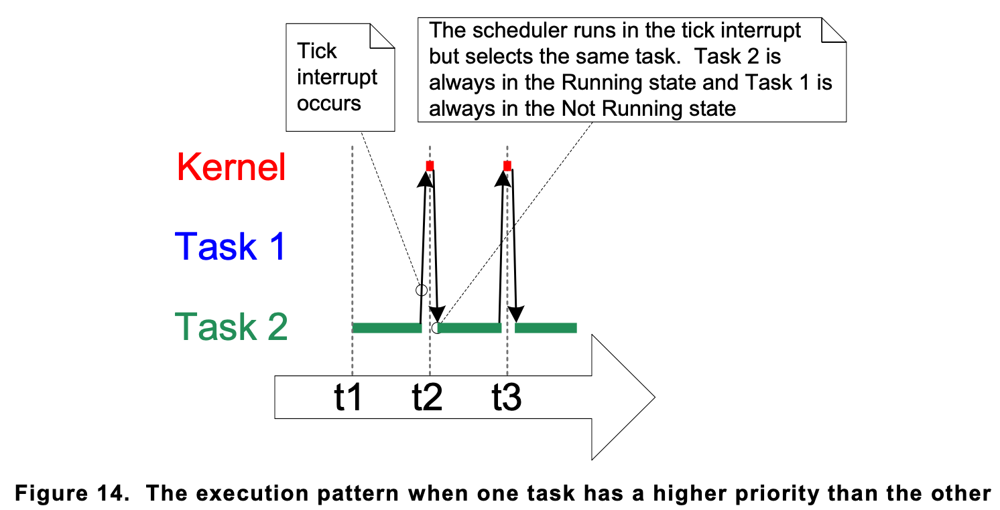

# Task Priorities - vTaskPrioritySet() API

- The uxPriority parameter of the xTaskCreate() API function assigns an initial priority to the task being created. The priority can be changed after the scheduler has been started by using the **vTaskPrioritySet()** API function.

1. [Generic method](#generic-method)
1. [Architecture optimized method (ESP32)](#architecture-optimized-method-esp32)
1. [Experimenting with priorities](#experimenting-with-priorities)

## Generic method

- The generic method is implemented in C, and can be used with all the FreeRTOS architecture ports.
- When the generic method is used, FreeRTOS does not limit the maximum value to which configMAX_PRIORITIES can be set. However, it is always advisable to keep the configMAX_PRIORITIES value at the minimum necessary, because the higher its value, the more RAM will be consumed, and the longer the worst case execution time will be.

```
#include "FreeRTOS.h"
#include "task.h"

// Define task function
void vTaskFunction(void *pvParameters) {
    // Task code goes here
}

int main(void) {
    
    // Create a task
    TaskHandle_t xTaskHandle;
    BaseType_t xTaskCreateResult = xTaskCreate(
        vTaskFunction,              // Task function
        "TaskName",                 // Task name
        configMINIMAL_STACK_SIZE,   // Stack depth
        NULL,                       // Task parameters
        tskIDLE_PRIORITY,           // Task priority
        &xTaskHandle);              // Task handle

    if (xTaskCreateResult == pdPASS) {      // Task created successfully

        vTaskPrioritySet(xTaskHandle, 2); // Change task priority, set priority to 2
    } 
    else
    {
        // Handle task creation failure
    }

    // Start the FreeRTOS scheduler
    vTaskStartScheduler();

    // Will not reach here unless there's an error in scheduler startup
    return 0;
}

```

## Architecture optimized method (ESP32)

- The architecture optimized method uses a small amount of assembler code, and is faster than the generic method. The configMAX_PRIORITIES setting does not affect the worst case execution time. 
- Not all FreeRTOS ports provide an architecture optimized method.
- For ESP32, you can use the vTaskPrioritySetFromISR() function to set the priority of a task. This function is optimized for the ESP32 architecture and can be called from an ISR (Interrupt Service Routine) context. Here's how you can use it
 
 ```
#include "FreeRTOS.h"
#include "task.h"

// Define task function
void vTaskFunction(void *pvParameters) {
    // Task code goes here
}

int main(void) {
    // Create a task
    TaskHandle_t xTaskHandle;
    BaseType_t xTaskCreateResult = xTaskCreate(
        vTaskFunction,              // Task function
        "TaskName",                 // Task name
        configMINIMAL_STACK_SIZE,   // Stack depth
        NULL,                       // Task parameters
        tskIDLE_PRIORITY,           // Task priority
        &xTaskHandle);              // Task handle

    if (xTaskCreateResult == pdPASS) {      // Task created successfully
        
        // Change task priority using architecture-optimized method
        vTaskPrioritySetFromISR(xTaskHandle, 2); // Set priority to 2
    } 
    else 
    {
        // Handle task creation failure
    }
    
    vTaskStartScheduler();      // Start the FreeRTOS scheduler

    // Will not reach here unless there's an error in scheduler startup
    return 0;
}
```

## Experimenting with priorities

- This example looks at what happens when the priority of one of the two tasks created in Example 2 is changed. This time, the first task will be created at priority 1, and the second at priority 2.

```
/* 
Define the strings that will be passed in as the task parameters. These are
defined const and not on the stack to ensure they remain valid when the tasks are
executing. 
*/

static const char *pcTextForTask1 = "Task 1 is running\r\n";
static const char *pcTextForTask2 = "Task 2 is running\r\n";

int main( void )
{
    /* Create the first task at priority 1. The priority is the second to last parameter. */
    BaseType_t xTaskCreateResult1 = xTaskCreate( vTaskFunction, "Task 1", 1000, (void*)pcTextForTask1, 1, NULL );

    /* Create the second task at priority 2, which is higher than a priority of 1. 
    The priority is the second to last parameter. */
    BaseType_t xTaskCreateResult2 = xTaskCreate( vTaskFunction, "Task 2", 1000, (void*)pcTextForTask2, 2, NULL );

    if (xTaskCreateResult1 == pdPASS && xTaskCreateResult2 == pdPASS) {
        
        vTaskStartScheduler();
    } 
    else 
    {
        // Handle task creation failure
        // This could be logging an error message, restarting the system, etc.
    }

    /* Will not reach here. */
    return 0;
}
```

- The scheduler will always select the highest priority task that is able to run. 
- Task 2 has a higher priority than Task 1 and is always able to run; therefore, Task 2 is the only task to ever enter the Running state. 
- As Task 1 never enters the Running state, it never prints out its string. 
- Task 1 is said to be ‘starved’ of processing time by Task 2.



- Task 2 is always able to run because it never has to wait for anything—it is either cycling around a null loop, or printing to the terminal.


