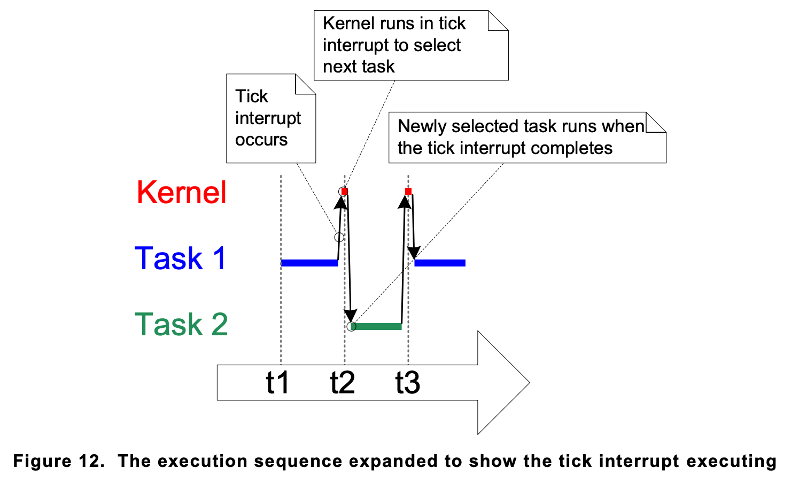

1. [Time slicing](#time-slicing)   
1. [pdMS_TO_TICKS()](#pdms_to_ticks-macro)    
    2.1 [examples](#example)   

## Time slicing 

- In the previous examples both tasks were created at same priority and both tasks were always able to run. Therefore each task executed for a time slice, entering the Running state at the start of a time slice, and exiting the Running state at the end of a time slice.

- To be able to select the next task to run, the scheduler itself must execute at the end of each time slice1. A periodic interrupt, called the 'tick interrupt', is used for this purpose.



## pdMS_TO_TICKS() macro

- FreeRTOS API calls always specify time in multiples of tick periods, which are often referred to simply as ‘ticks’.
- The pdMS_TO_TICKS() macro converts a time specified in milliseconds into a time specified in ticks. 
- The resolution available depends on the defined tick frequency, and pdMS_TO_TICKS() cannot be used if the tick frequency is above 1KHz (if configTICK_RATE_HZ is greater than 1000).

### Example 

- Convert a time specified as 200 milliseconds into an equivalent time specified in ticks.

```
/* pdMS_TO_TICKS() takes a time in milliseconds as its only parameter, and evaluates
to the equivalent time in tick periods. This example shows xTimeInTicks being set to
the number of tick periods that are equivalent to 200 milliseconds. */

TickType_t xTimeInTicks = pdMS_TO_TICKS( 200 );

```

- Note: It is not recommended to specify times in ticks directly within the application, but instead to use the pdMS_TO_TICKS() macro to specify times in milliseconds, and in so doing, ensuring times specified within the application do not change if the tick frequency is changed.

- The ‘tick count’ value is the total number of tick interrupts that have occurred since the scheduler was started, assuming the tick count has not overflowed. User applications do not have to consider overflows when specifying delay periods, as time consistency is managed internally by FreeRTOS.