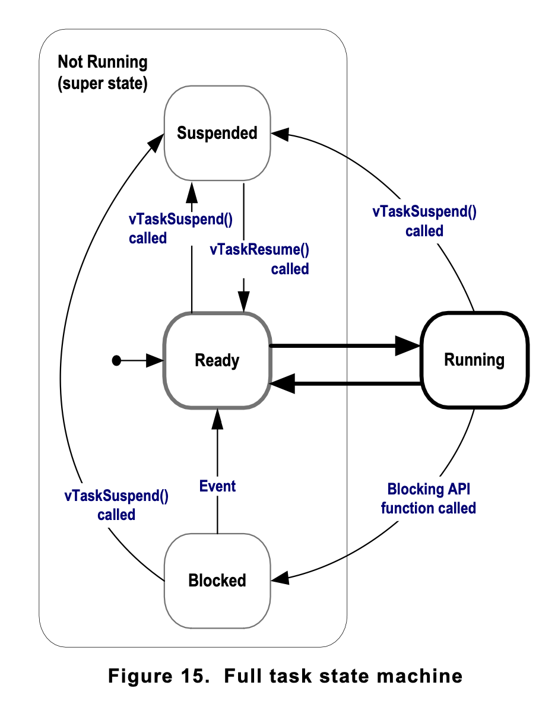

1. [Event driven](#event-driven)   
2. [States](#states)   
    2.1 [Blocked state](#blocked-state)   
    2.2 [Suspended State](#suspended-state)   
    2.3 [Ready State](#ready-state)   

## Event driven 

- An event-driven task has work (processing) to perform only after the occurrence of the event that triggers it, and is not able to enter the Running state before that event has occurred.
- The scheduler always selects the highest priority task that is able to run. 
- High priority tasks not being able to run means that the scheduler cannot select them and must, instead, select a lower priority task that is able to run. 
- Therefore, using event-driven tasks means that tasks can be created at different priorities without the highest priority tasks starving all the lower priority tasks of processing time.

## States

### Blocked state

Tasks can enter the Blocked state to wait for two different types of event:

1. Temporal (time-related) events—the event being either a delay period expiring, or an absolute time being reached. For example, a task may enter the Blocked state to wait for 10 milliseconds to pass.

2. Synchronization events—where the events originate from another task or interrupt. For example, a task may enter the Blocked state to wait for data to arrive on a queue. Synchronization events cover a broad range of event types.

### Suspended state

- ‘Suspended’ is also a sub-state of Not Running. Tasks in the Suspended state are not available to the scheduler. 
- The only way into the Suspended state is through a call to the vTaskSuspend() API function, the only way out being through a call to the vTaskResume() or xTaskResumeFromISR() API functions. 
- Most applications do not use the Suspended state.

### Ready State

- Tasks that are in the Not Running state but are not Blocked or Suspended are said to be in the Ready state. 
- They are able to run, and therefore ‘ready’ to run, but are not currently in the Running state.

