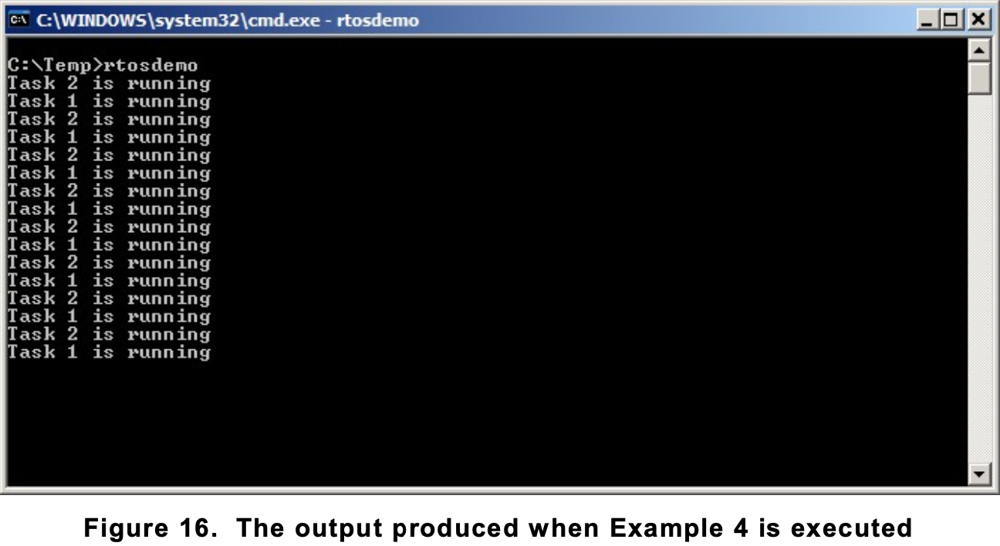
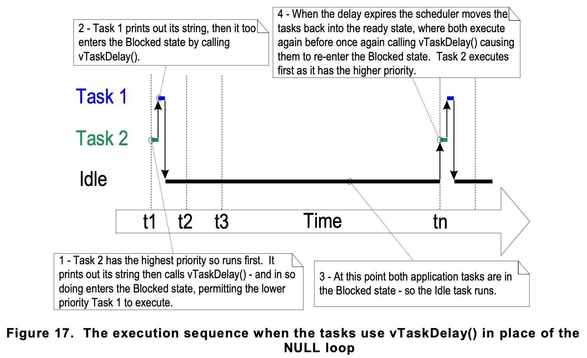
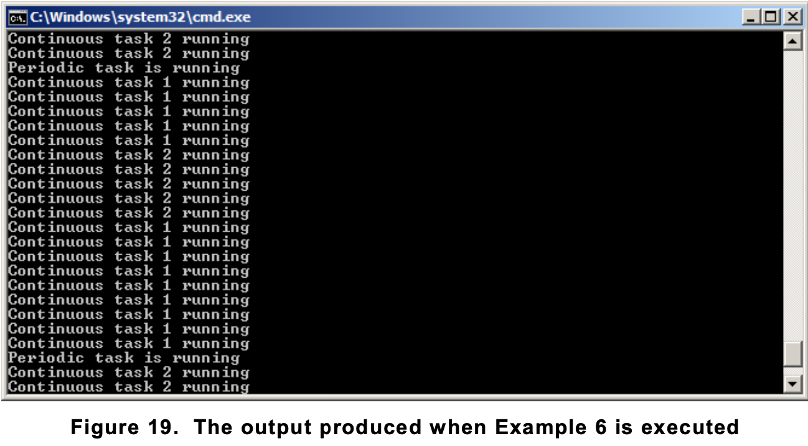
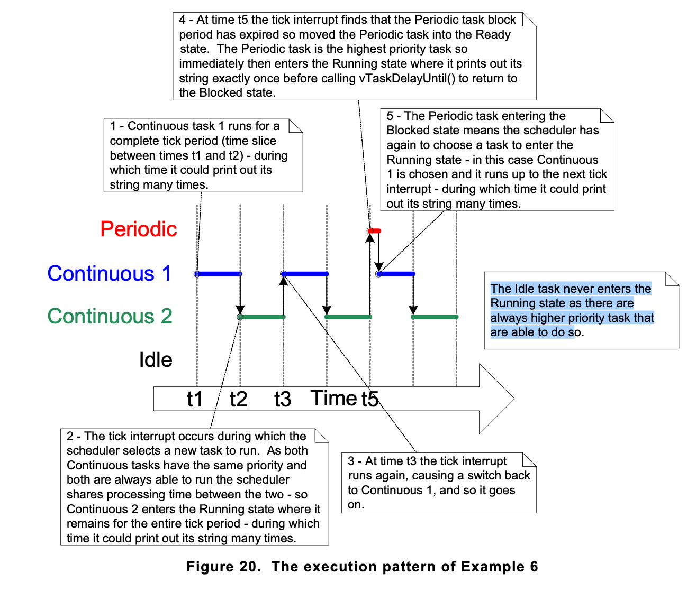

1. [vTaskDelay](#vtaskdelay)    
2. [vTaskDelayUntil](#vtaskdelayuntil-api)   
    2.1 [Example1 Using vTaskDelayUntil()](#converting-the-example-tasks-to-use-vtaskdelayuntil)    
    2.2 [Example2 Combining blocking and non-blocking tasks](#combining-blocking-and-non-blocking-tasks)    

## vTaskDelay()
 
- During polling, the task does not really have any work to do, but it still uses maximum processing time, and so wastes processor cycles.
- We can replace the polling null loop with a call to the vTaskDelay() API function.
- vTaskDelay() API function is available only when INCLUDE_vTaskDelay is set to 1 in FreeRTOSConfig.h.
- vTaskDelay() places the calling task into the Blocked state for a fixed number of tick interrupts.
- The task does not use any processing time while it is in the Blocked state, so the task only uses processing time when there is actually work to be done.

`void vTaskDelay( TickType_t xTicksToDelay );`

- xTicksToDelay: The number of tick interrupts that the calling task will remain in the Blocked state before being transitioned back into the Ready state.

- vTaskDelay( pdMS_TO_TICKS( 100 ) ) will result in the calling task remaining in the Blocked state for 100 milliseconds.

```
void vTaskFunction( void *pvParameters )
{
    char *pcTaskName;
    const TickType_t xDelay250ms = pdMS_TO_TICKS( 250 );
    
    /* The string to print out is passed in via the parameter. Cast this to a character pointer. */
    pcTaskName = ( char * ) pvParameters;

    while(true)
    {
        /* Print out the name of this task. */
        vPrintString( pcTaskName );
    
        vTaskDelay( xDelay250ms );
    }
}
```

- Even though the two tasks are still being created at different priorities, both will now run.


 
- The idle task is created automatically when the scheduler is started, to ensure there is always at least one task that is able to run



## vTaskDelayUntil() API   

- The parameters to vTaskDelayUntil() specify the exact tick count value at which the calling task should be moved from the Blocked state into the Ready state. 
- **vTaskDelayUntil()** is the API function that should be used when a fixed execution period is required (where you want your task to execute periodically with a fixed frequency), as the time at which the calling task is unblocked is absolute, rather than relative to when the function was called (as is the case with vTaskDelay()).

`void vTaskDelayUntil( TickType_t * pxPreviousWakeTime, TickType_t xTimeIncrement );`

| Parameter Name | Description |
| :--- | :--- |
| pxPreviousWakeTime | This time is used as a reference point to calculate the time at which the task should next leave the Blocked state. |
| xTimeIncrement | This parameter is also named on the assumption that vTaskDelayUntil() is being used to implement a task that executes periodically and with a fixed frequency—the frequency being set by the xTimeIncrement value. xTimeIncrement is specified in ‘ticks’. The macro pdMS_TO_TICKS() can be used to convert a time specified in milliseconds into a time specified in ticks. |

### Converting the example tasks to use vTaskDelayUntil()

```
void vTaskFunction( void *pvParameters )
{
    char *pcTaskName;
    TickType_t xLastWakeTime;

    pcTaskName = ( char * ) pvParameters;

    /* The xLastWakeTime variable needs to be initialized with the current tick count. 
    Note that this is the only time the variable is written to explicitly.
    After this xLastWakeTime is automatically updated within vTaskDelayUntil(). */

    xLastWakeTime = xTaskGetTickCount();

    while(true)
    {
        vPrintString( pcTaskName );         /* Print out the name of this task. */

        /* This task should execute every 250 milliseconds exactly. 
        As per the vTaskDelay() function, time is measured in ticks, and the pdMS_TO_TICKS()
        macro is used to convert milliseconds into ticks.
        xLastWakeTime is automatically updated within vTaskDelayUntil(), so is not
        explicitly updated by the task. */
        vTaskDelayUntil( &xLastWakeTime, pdMS_TO_TICKS( 250 ) );
    }
}
```

### Combining blocking and non-blocking tasks

- Previous examples have examined the behavior of both polling and blocking tasks in isolation.
- This example re-enforces the stated expected system behavior by demonstrating an execution sequence when the two schemes are combined, as follows.

1. Two tasks are created at priority 1. 
    - These do nothing other than continuously print out a string.
    - These tasks never make any API function calls that could cause them to enter the Blocked state, so are always in either the Ready or the Running state. 
    - Tasks of this nature are called ‘continuous processing’ tasks, as they always have work to do (albeit rather trivial work, in this case). 

2. A third task is then created at priority 2. 
    - so above the priority of the other two tasks.
    - The third task also just prints out a string, but this time periodically, so uses the vTaskDelayUntil() API function to place itself into the Blocked state between each print iteration.

The source for the periodic task is shown below

```
void vContinuousProcessingTask( void *pvParameters )
{
    char *pcTaskName;

    pcTaskName = ( char * ) pvParameters;

    while(true)
    {
        /* Print out the name of this task. This task just does this repeatedly without ever blocking or delaying. */
        vPrintString( pcTaskName );
    }
}

void vPeriodicTask( void *pvParameters )
{
    TickType_t xLastWakeTime;
    const TickType_t xDelay3ms = pdMS_TO_TICKS( 3 );
    
    xLastWakeTime = xTaskGetTickCount();        /* needs to be initilized only once */

    while(true)
    {
        vPrintString( "Periodic task is running\r\n" );
       
        vTaskDelayUntil( &xLastWakeTime, xDelay3ms );   /* The task should execute every 3 milliseconds exactly */
    }
}
```





