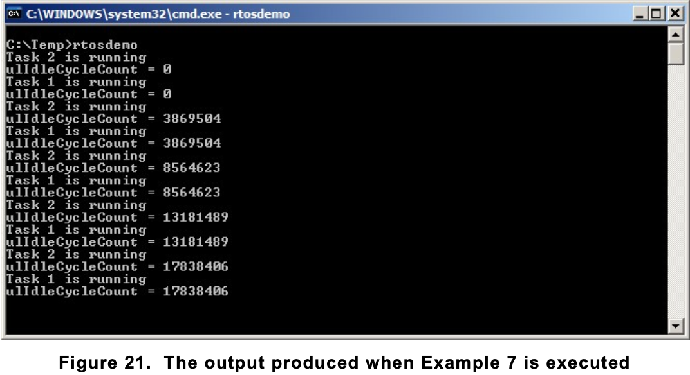

1. [The Idle Task and the Idle Task Hook](#the-idle-task-and-the-idle-task-hook)
    1.1 [Idle Task Hook Functions](#idle-task-hook-functions)
    1.2 [Idle task hook Prototype](#idle-task-hook-prototype)
    1.3 [Example]()

## The Idle Task and the Idle Task Hook

- There must always be at least one task that can enter the Running state1.
- To ensure this is the case, an Idle task is automatically created by the scheduler when vTaskStartScheduler() is called.
- The idle task has the lowest possible priority (priority zero), to ensure it never prevents a higher priority application task from entering the Running state.
- The configIDLE_SHOULD_YIELD compile time configuration constant in FreeRTOSConfig.h can be used to prevent the Idle task from consuming processing time that would be more productively allocated to applications tasks.

- Running at the lowest priority ensures the Idle task is transitioned out of the Running state as soon as a higher priority task enters the Ready state. 
- This can be seen at time tn in Figure 17, where the Idle task is immediately swapped out to allow Task 2 to execute at the instant Task 2 leaves the Blocked state. 
- Task 2 is said to have pre-empted the idle task. Pre-emption occurs automatically, and without the knowledge of the task being pre-empted. 

- Note: If an application uses the vTaskDelete() API function then it is essential that the Idle task is not starved of processing time. This is because the Idle task is responsible for cleaning up kernel resources after a task has been deleted.

### Idle Task Hook Functions
 
- It is possible to add application specific functionality directly into the idle task through the use of an idle hook (or idle callback) function.
- a function that is called automatically by the idle task once per iteration of the idle task loop.

- Common uses for the Idle task hook include:
    - Executing low priority, background, or continuous processing functionality.
    - Measuring the amount of spare processing capacity. (The idle task will run only when all higher priority application tasks have no work to perform; so measuring the amount of processing time allocated to the idle task provides a clear indication of how much processing time is spare.)
    - Placing the processor into a low power mode, providing an easy and automatic method of saving power whenever there is no application processing to be performed (although the power saving that can be achieved using this method is less than can be achieved by using the tick-less idle mode described in Chapter 10, Low Power Support).

- Limitations on the Implementation of Idle Task Hook Functions Idle task hook functions must adhere to the following rules.
    1. An Idle task hook function must never attempt to block or suspend.   
    Note: Blocking the idle task in any way could cause a scenario where no tasks are available to enter the Running state.
    2. If the application makes use of the vTaskDelete() API function, then the Idle task hook must always return to its caller within a reasonable time period.    
    This is because the Idle task is responsible for cleaning up kernel resources after a task has been deleted.   
    If the idle task remains permanently in the Idle hook function, then this clean-up cannot occur.    

#### Idle task hook Prototype
` void vApplicationIdleHook( void ); `

#### Example 

- The use of blocking vTaskDelay() API calls in Example 4 created a lot of idle time—time when the Idle task is executing because both application tasks are in the Blocked state.
- Example 7 makes use of this idle time through the addition of an Idle hook function

```
/* Declare a variable that will be incremented by the hook function. */
volatile uint32_t ulIdleCycleCount = 0UL;
/* Idle hook functions MUST be called vApplicationIdleHook(), take no parameters, and return void. */

void vApplicationIdleHook( void )
{
    /* This hook function does nothing but increment a counter. */
    ulIdleCycleCount++;
}
```

- configUSE_IDLE_HOOK must be set to 1 in FreeRTOSConfig.h for the idle hook function to get called.
- The function that implements the created tasks is modified slightly to print out the ulIdleCycleCount value

```
void vTaskFunction( void *pvParameters )
{
    char *pcTaskName;
    const TickType_t xDelay250ms = pdMS_TO_TICKS( 250 );
    
    /* The string to print out is passed in via the parameter. Cast this to a character pointer. */
    pcTaskName = ( char * ) pvParameters;

    while(true)
    {
        /* Print out the name of this task AND the number of times ulIdleCycleCount has been incremented. */
        vPrintStringAndNumber( pcTaskName, ulIdleCycleCount );

        /* Delay for a period of 250 milliseconds. */
        vTaskDelay( xDelay250ms );
    }
}
```

- The output produced by Example 7 is shown in Figure 21. 
- It shows the idle task hook function is called approximately 4 million times between each iteration of the application tasks (the number of iterations is dependent on the speed of the hardware on which the demo is executed).



